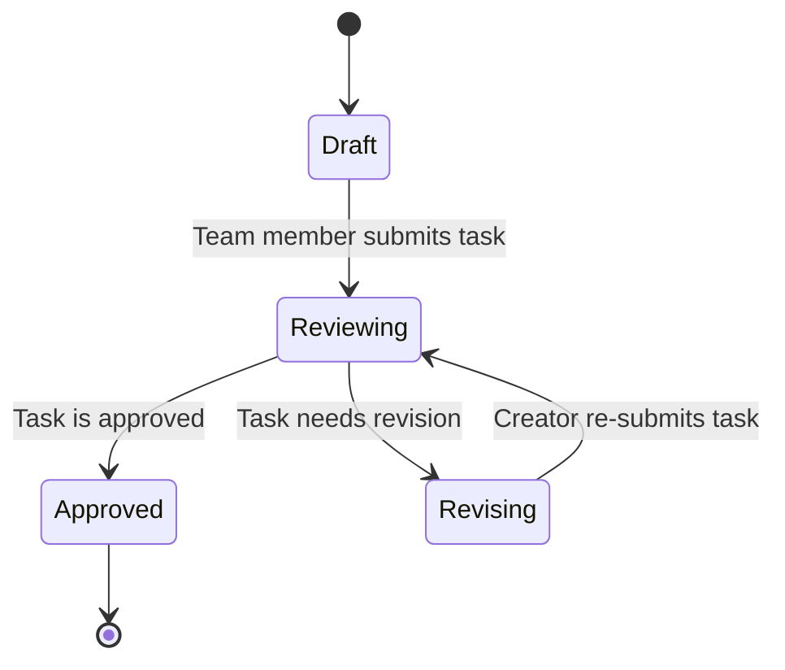

# HR Task Workflow Documentation

This document describes the `hr-task` workflow, designed for tracking tasks within the HR team.

## Objective

The primary purpose of this workflow is to serve as a general task tracking board for the HR team. The default flow is designed for team members to create tasks that are automatically assigned to the team lead for review and approval.

---

## Workflow Diagram

The process begins in the default "Draft" lane, which is visible only to the creator.

---

## Roles

- **Creator:** An HR team member who creates a new task in the system.
- **Owner:** The person responsible for reviewing and actioning the task. **The Owner defaults to the HR Manager (`dachopol.w@muze.co.th`)** when a new task is created.
- **Contact Point:** The person who created the task. This field is a dropdown menu where the creator selects their own email to receive notifications about the task's progress.

---

## Statuses

The workflow utilizes the system's built-in **Draft** lane as the starting point for all new tasks.

1.  **Draft:** The initial state for all newly created tasks, visible only to the creator.
2.  **Reviewing:** The task has been submitted to the `Owner` (HR Manager) for review.
3.  **Revising:** The `Owner` has returned the task to the `Creator` for changes, with comments provided in the `Feedback` field.
4.  **Approved:** The task has been approved and the process is complete.

---

## Card Fields

- **`Contact Point`**: (Dropdown) The email of the task's creator, selected from a predefined list to receive notifications. This field is required to submit a task for review.
- **`Document Link`**: (URL) The primary document link for review (Optional).
- **`Reference Link`**: (URL) Other relevant reference links (Optional).
- **`Due Date`**: (Text) The expected completion date for the task (Optional, Format: YYYY-MM-DD).
- **`Feedback / Revision Reason`**: (Text) The reason for returning the task for revision. This field is only visible when the status is `Revising`.

---

## Automated Actions

The workflow is configured with the following automated email notifications:

- **On transition to `Reviewing`:** An email is sent to the **Owner** (HR Manager).
- **On transition to `Revising`:** An email is sent back to the **Contact Point** (the Creator), including the `Feedback`.
- **On transition to `Approved`:** An email is sent to the **Contact Point** (the Creator).

---

## Future Enhancements

This section lists potential features to be added in the future to improve the workflow.

- **Due Date Reminders:** Implement a scheduled notification system to send an email reminder to the relevant parties (e.g., `Owner`) a specified number of days (X days) before the `dueDate` is reached. This will require a platform-level enhancement to support time-based triggers.
