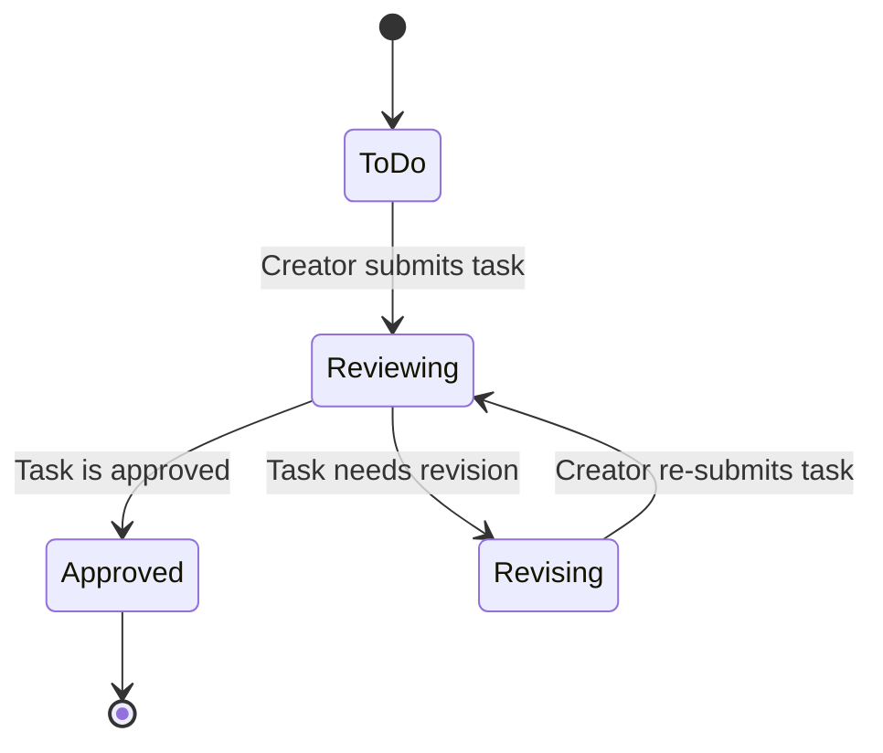

# HR Task Workflow Documentation

This document describes the `hr-task` workflow, designed for tracking tasks within the HR team.

## Objective

The primary purpose of this workflow is to serve as a general task tracking board for the HR team. The default flow is designed for team members to submit tasks to the team lead for review and approval. However, the workflow is highly flexible, allowing the task creator to change the assignee in the `Contact Point` field to delegate tasks to other team members as well.

---

## Workflow Diagram

---

## Roles

- **Creator:** An HR team member who creates a new task in the system.
- **Owner:** The person responsible for the task from start to finish. In this workflow, the **Owner is automatically assigned to be the same person as the Creator** when the task is submitted for review.
- **Contact Point:** The person assigned to review and take action on the task. The default value is the team lead, but this can be changed based on the task's requirements.

---

## Statuses

1.  **To Do:** The initial state for all newly created tasks.
2.  **Reviewing:** The task has been submitted to the `Contact Point` for review.
3.  **Revising:** The `Contact Point` has returned the task to the `Creator` for changes, with comments provided in the `Feedback` field.
4.  **Approved:** The task has been approved and the process is complete.

---

## Card Fields

- **`Contact Point`**: (Text) The email of the person responsible for the task. **Defaults to `dachopol.w@muze.co.th`**. This is the only required field to submit a task for review.
- **`Document Link`**: (URL) The primary document link for review (Optional).
- **`Reference Link`**: (URL) Other relevant reference links (Optional).
- **`Due Date`**: (Text) The expected completion date for the task (Optional, Format: YYYY-MM-DD).
- **`Feedback / Revision Reason`**: (Text) The reason for returning the task for revision. This field is only visible when the status is `Revising`.

---

## Automated Actions

The workflow is configured with the following automated email notifications:

- **On transition to `Reviewing`:** An email is sent to the `Contact Point`.
- **On transition to `Revising`:** An email is sent back to the `Creator`, including the `Feedback`.
- **On transition to `Approved`:** An email is sent to the `Creator`.

---

## Future Enhancements

This section lists potential features to be added in the future to improve the workflow.

- **Due Date Reminders:** Implement a scheduled notification system to send an email reminder to the relevant parties (e.g., `Contact Point`) a specified number of days (X days) before the `dueDate` is reached. This will require a platform-level enhancement to support time-based triggers.
